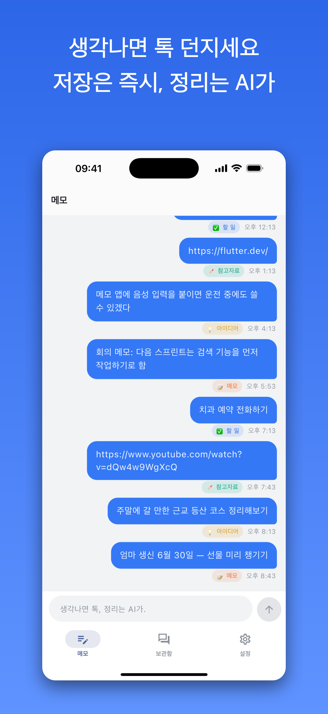
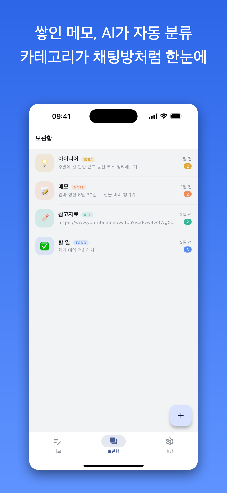
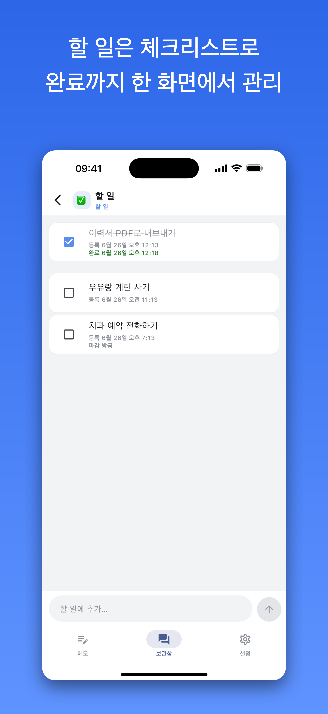
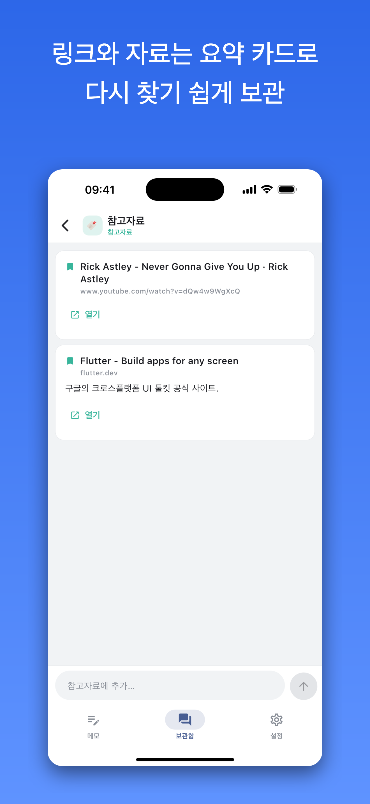
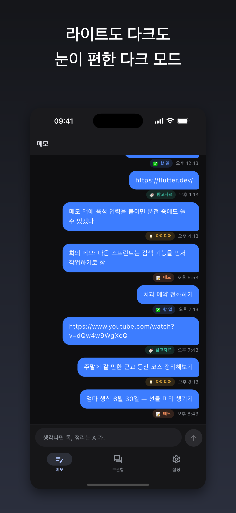
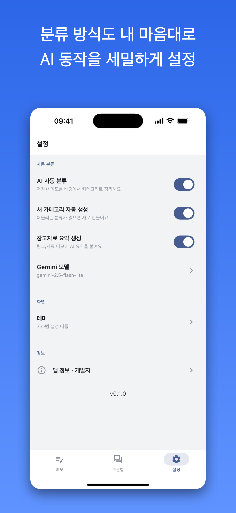

# Awesome Memo · 나에게 보내기

> **생각나면 톡 던지고, 정리는 AI가.** 메신저 스타일 입력 + LLM 자동 분류 + 생성형 UI 메모 앱.

메모를 "나에게 보내기" 채팅처럼 입력하면 즉시 저장되고, 백그라운드에서
Firebase AI Logic(Gemini)이 내용을 분석해 어울리는 카테고리로 분류합니다.
카테고리는 메신저 채팅방 목록처럼 보이고, 각 방은 성격(할 일/참고자료/아이디어/메모)에
맞춰 생성형 UI(genui)로 다르게 렌더링됩니다.

<p align="center">
  <em>Flutter</em> · <em>Riverpod</em> · <em>Drift</em> · <em>Freezed</em> · <em>Firebase AI Logic (Gemini)</em> · <em>Clean Architecture</em>
</p>

## 스크린샷

<table>
  <tr>
    <td align="center" width="33%">
      <br/>
      <sub><b>톡 던지듯 입력</b><br/>저장은 즉시, 정리는 AI가</sub>
    </td>
    <td align="center" width="33%">
      <br/>
      <sub><b>AI 자동 분류</b><br/>카테고리가 채팅방처럼</sub>
    </td>
    <td align="center" width="33%">
      <br/>
      <sub><b>유형별 생성형 UI</b><br/>할 일은 체크리스트로</sub>
    </td>
  </tr>
  <tr>
    <td align="center" width="33%">
      <br/>
      <sub><b>요약 카드</b><br/>링크·자료는 다시 찾기 쉽게</sub>
    </td>
    <td align="center" width="33%">
      <br/>
      <sub><b>라이트 · 다크</b><br/>눈이 편한 다크 모드</sub>
    </td>
    <td align="center" width="33%">
      <br/>
      <sub><b>세밀한 설정</b><br/>AI 동작을 내 마음대로</sub>
    </td>
  </tr>
</table>

<sub>스토어 제출용 에셋(iOS · Android 사이즈, 피처 그래픽)과 재현 스크립트는
<a href="screenshots/README.md"><code>screenshots/</code></a>에 있습니다.</sub>

## 주요 기능

1. **채팅형 메모 입력** — 메인 화면은 메신저의 나에게 보내기 채팅창. 메모가 버블로 쌓임.
2. **백그라운드 자동 분류** — 저장은 즉시(1차), 분류는 비동기. 실패 시 재시도.
3. **매칭 우선 분류** — 기존 카테고리에 맞으면 매핑, 없으면 새 카테고리 생성.
4. **채팅방 목록 UI** — 카테고리당 채팅방 1개(미리보기·개수·최근 활동순).
5. **카테고리별 생성형 UI** — `genui` + Firebase AI로 방마다 동적 UI. 미설정/실패 시
   카테고리 유형별 결정적 레이아웃(체크리스트/요약카드/타임라인)으로 폴백.
6. **설정 · 앱 정보 · 온보딩** — 하단 탭(메모·보관함·설정), 라이트/다크 테마.

## 아키텍처

Clean Architecture + Riverpod + Freezed + Drift.

```
lib/
├─ app/                  # MaterialApp, go_router, 하단 탭 셸
├─ core/                 # theme(디자인 시스템), error(Result/Failure),
│                        #   router, constants, utils, providers, firebase
├─ domain/               # entities(Freezed), repository 인터페이스
├─ data/                 # Drift DB, mappers, repository 구현(로컬 우선)
└─ features/
   ├─ memo_chat/         # 메인 채팅 입력
   ├─ categories/        # 채팅방(카테고리) 목록
   ├─ category_detail/   # 방 상세 + genui 동적 UI + 유형별 폴백 레이아웃
   ├─ classification/    # firebase_ai 분류 서비스 + 백그라운드 워커
   ├─ settings/          # 설정(모델·테마·토글)
   ├─ about/             # 앱/개발자 정보
   └─ onboarding/        # 첫 실행 온보딩
```

- **저장소:** 로컬 우선(Drift). 동기화/백업은 추후 확장 지점.
- **LLM:** Firebase AI Logic(Gemini). 기본 `gemini-3.5-flash`, 실패 시
  `gemini-2.5-flash`로 폴백(설정에서 변경 가능).
- **디자인 시스템:** `lib/core/theme/`에 토큰 분리(색/타이포/간격), 라이트+다크.

## 시작하기

### 1) 의존성 설치
```bash
flutter pub get
```

### 2) 코드 생성 (Freezed · Drift)
> ⚠️ 이 프로젝트는 반드시 `--force-jit`로 실행하세요. 의존성 그래프의
> `objective_c` 네이티브 빌드 훅 때문에 기본 AOT 경로가 실패합니다.
```bash
dart run build_runner build --force-jit
```

### 3) Firebase 연동 (AI 기능 활성화)
Firebase 미설정 상태에서도 메모 저장은 동작하며, 자동 분류/생성형 UI만 꺼집니다.
AI 기능을 켜려면:
```bash
dart pub global activate flutterfire_cli
flutterfire configure
```
연동 후 안정적인 초기화를 위해 `lib/core/firebase/firebase_init.dart`를
생성된 옵션을 쓰도록 바꾸는 것을 권장합니다(파일 상단 주석 참고).
Firebase 콘솔에서 **AI Logic(Gemini)** 도 활성화해야 합니다.

### 4) 실행
```bash
flutter run
```

## 기술 스택

Flutter · Riverpod · Drift · Freezed · go_router · Firebase AI Logic(`firebase_ai`) ·
생성형 UI(`genui`).

## 메모

- `nyangmemo_*.md/html`은 초기 컨셉(고양이 마스코트) 디자인 산출물입니다. 현재 앱은
  중립적인 미니멀 메신저 톤으로 새로 구성했습니다(참고용 보관).
- `genui`는 alpha 단계로 API가 바뀔 수 있습니다. 관련 코드는
  `lib/features/category_detail/genui/`에 격리되어 있습니다.

## 알려진 이슈 — Gemini 사용량/제한

무료(Gemini Developer API) 등급은 분당 요청·할당량 제한이 있습니다. 여러 메모를
한꺼번에 분류하는 등 호출이 몰리면 일부가 과부하
(`ServerException: ... is overloaded`)나 할당량 초과(`QuotaExceeded`, 429)로
실패할 수 있습니다.

- **증상:** 간헐적으로 메모가 "미분류"로 떨어짐(특히 버스트 직후). 잠시 뒤 자동 회복.
- **현재 대응:** 실패/타임아웃 메모는 미분류 보관함에 모이고, 방의 **"전체 재분류"**로
  기존 카테고리에 다시 매칭을 시도합니다.
- **완화책:** 동시 처리 수를 낮추거나(`AppConstants.classifyConcurrency`), Blaze
  요금제로 올려 한도를 늘리세요.
